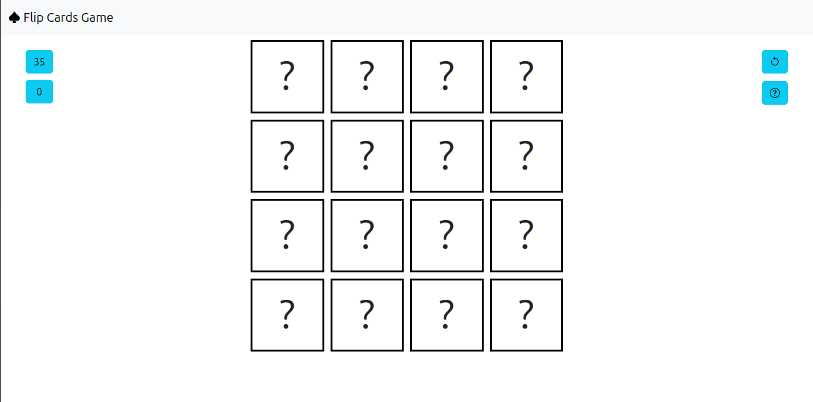

# 🎮 Flip Card Game

## 🕹️ Description

Challenge your memory with this simple flip card game!  
All cards are hidden at the start. Flip two cards at a time to find matching pairs. The game tests your concentration and memory skills.

> Inspired by classic memory games, this project was built to create a fun and interactive way to improve short-term memory.

## 🚀 Getting Started

**Play the game here:** [Deployed Game Link](https://aliashwal03.github.io/flip-card-game/)

**Project Planning Materials:**   
- [Trello Board](https://trello.com/b/70GNunNz/project-1)

**How to play:**
1. Open the game using the link above.
2. Click on any two cards to flip them.
3. If the cards match, they stay flipped. If not, they flip back automatically.
4. Match all the pairs to win!

## 💡 Technologies Used

- HTML
- CSS
- JavaScript

## 🚧 Next Steps

- Implement levels or increasing difficulty
- Add sound effects and animations
- Make the layout fully responsive for mobile devices
